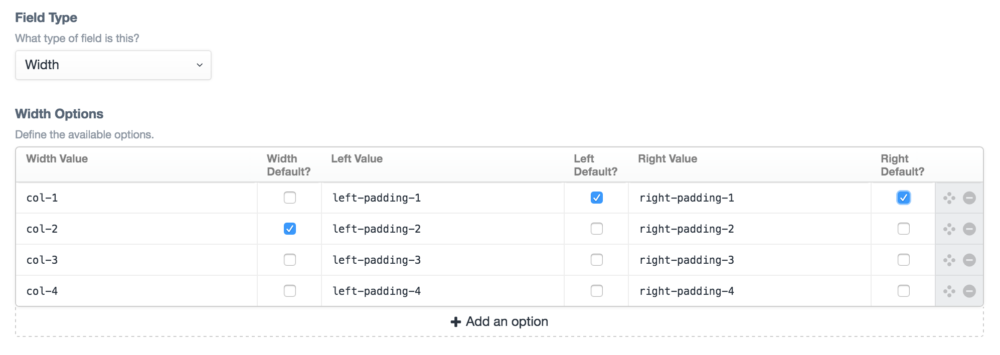
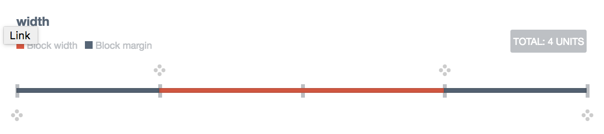

# Odds & Ends

A collection of useful tools for Craft CMS websites.

## Field types

### Width
This lets you define the width of a block as well as left and right padding. This field simply outputs three sets of classes which can be defined when setting the field up.




### Author Instructions
This lets you output markdown instead of a field, which is useful when you have a Matrix block that doesn’t have any fields.


### Categories (multiple groups)
A Categories input that lets you select multiple Category groups.

### Ancestors
An Entries input that only shows the ancestors of the current Entry.

### Search Fields
Like the Tags input, but for Entries and Categories (without the auto-creation feature).

### Disabled Fields
The same as regular fields, but disabled. Useful for situations where you want to integrate with a third party API and store that information in a field but don’t want the user to change it.

The following field types are currently supported:

- Entries
- Categories
- Lightswitch
- Number
- PlainText
- Dropdown

## Widgets

### Roll Your Own
A simple widget that lets you assign a template to load from your site templates folder. Go nuts.

## Config variables

### `openInstructionLinksInNewWindow`

Default: `true`

Set this to true to force all instruction links to open in new a window/tab.

## Miscellaneous

### Download File

A controller action that will download an asset file.

The `id` parameter is required and must be a valid asset ID.

Usage:
```
<a href="{{ actionUrl('tools/tools/download-file', { id: 10974 }) }}">Download</a>
```

---

*Created by [Supercool](http://www.supercooldesign.co.uk/)*
<br>
*Maintained by [Spicy Web](https://spicyweb.com.au)*
